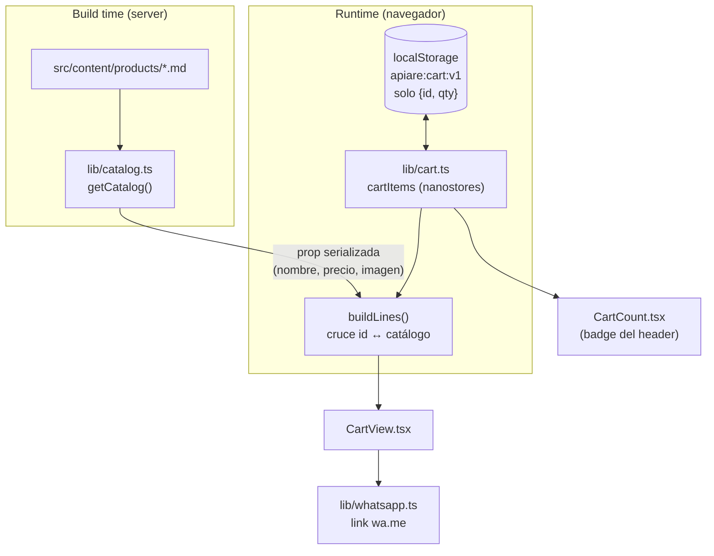

# Sistema de carrito

Cómo funciona el carrito de Apiaré: decisiones, arquitectura y mapa de archivos.

---

## 1. Resumen de la decisión

El carrito vive **en el navegador**, en `localStorage`, sin base de datos y sin
backend. El checkout se resuelve armando un mensaje de WhatsApp.

Por qué:

- No hay usuarios ni autenticación. Un carrito server-side necesitaría sesiones,
  y las sesiones necesitan almacenamiento y una cookie.
- El catálogo son 4 archivos Markdown en una content collection. Se conoce
  entero en build time.
- Un carrito server-side obligaría a poner `prerender = false` en páginas que hoy
  son estáticas y se sirven gratis desde el CDN de Cloudflare.

El costo de esta decisión: el carrito no se sincroniza entre dispositivos, y se
pierde si el usuario limpia los datos del navegador. Para una tienda que cierra
la venta por WhatsApp, es un costo aceptable.

---

## 2. El principio central

**En `localStorage` se guarda únicamente `{ id, qty }`.**

```jsonc
// Lo que hay en localStorage bajo la clave "apiare:cart:v1"
[
  { "id": "honey-md", "qty": 2 },
  { "id": "honey-xs", "qty": 1 },
]
```

Nunca el nombre, el precio ni la imagen. Todo eso se resuelve en el momento de
mostrar el carrito, cruzando esos ids contra el catálogo real del build.

Si se serializara el producto entero:

- Cambiás un precio en `honey-md.md` y quien vuelve a los tres días sigue viendo
  el precio viejo.
- Borrás un producto y queda un fantasma imposible de comprar.
- El precio queda editable desde devtools.

Con el enfoque actual, los tres problemas desaparecen solos: el precio se lee
siempre del catálogo, y un producto inexistente simplemente no genera línea.

---

## 3. Arquitectura



Los dos lados nunca se mezclan: el catálogo baja del build con los datos de
producto ya resueltos (incluidas las miniaturas optimizadas), y el navegador solo
aporta las cantidades.

---

## 4. Mapa de archivos

### `src/lib/catalog.ts`

Corre **solo en el server**, en build time. Expone:

- `interface Product` — la forma plana y serializable de un producto. Es lo que
  puede viajar como prop hacia una isla de React: sin `ImageMetadata` ni objetos
  que React no sepa recibir.
- `getCatalog()` — lee la colección y devuelve los productos con la miniatura ya
  optimizada vía `getImage()` (200×200, WebP).

Usa `astro:content` y `astro:assets`, que no existen en el cliente. Por eso está
separado de `cart.ts`.

### `src/lib/cart.ts`

Corre **en el navegador**. Es el estado compartido.

- `cartItems` — un `persistentAtom` de nanostores. Persiste en `localStorage` y
  se sincroniza solo entre pestañas.
- `addItem` / `setQty` / `removeItem` / `clearCart` — las mutaciones.
- `totalItems` — computed con el total de unidades, para el badge.
- `buildLines(items, catalog)` — el cruce contra el catálogo. Descarta ids que ya
  no existen y calcula subtotales.

Dos detalles que no son obvios:

**La clave versionada.** `"apiare:cart:v1"`. Si algún día cambia la forma del
objeto guardado, basta con pasar a `v2` y los carritos viejos quedan huérfanos en
vez de romper la aplicación.

**El `decode` defensivo.** `JSON.parse` a secas explota si alguien tocó el
storage a mano. Envuelto en `try/catch` y validando que sea un array, un dato
corrupto devuelve un carrito vacío en vez de tumbar toda la isla.

**El `keepMount` con guarda.** nanostores "monta" un store recién cuando tiene
suscriptores. `AddToCartButton` llama a `addItem()` sin estar suscripto, y sin
`keepMount` ese `.get()` podría leer el valor inicial vacío y pisar el carrito.
La guarda `typeof window !== "undefined"` existe porque este módulo también se
evalúa en el server (workerd) cuando lo importa una isla `client:load`, y ahí no
hay `localStorage` al que engancharse.

### `src/lib/format.ts`

`formatPrice(2500)` → `"$ 2.500"`, vía `Intl.NumberFormat("es-AR")`. Se usa en la
ficha de producto, en la galería y en el carrito, para que el precio se vea igual
en los tres lados.

### `src/lib/whatsapp.ts`

`buildWhatsappUrl(lines, total)` arma el link `wa.me` con el pedido en texto
plano. El número sale de `PUBLIC_WHATSAPP_PHONE`.

El `encodeURIComponent` no es opcional: sin él, los saltos de línea y los
caracteres especiales rompen la URL.

### `src/components/Cart/CartCount.tsx`

Isla mínima: solo el número. Dos variantes — `text` para el `CARRITO [n]` del
desktop, `badge` para el globito. El globito no se renderiza cuando el carrito
está vacío, porque un `0` flotando se ve como un error.

### `src/components/Cart/AddToCartButton.tsx`

El botón AÑADIR. Escribe en el store y muestra un `AGREGADO ✓` durante 1,5 s. El
timer se limpia en el `useEffect` de desmontaje.

### `src/components/Cart/CartView.tsx`

La isla grande de `/carrito`. Recibe el catálogo como prop, lo cruza con lo
guardado y renderiza líneas, controles de cantidad, total y el CTA de WhatsApp.
Tiene estado vacío propio.

Usa `` común y no `<Image>` de `astro:assets` porque acá ya estamos en
React: la imagen viene optimizada desde `getCatalog()`, solo hay que mostrarla.

### `src/pages/carrito.astro`

Página estática. Llama a `getCatalog()` en el frontmatter y le pasa el resultado a
`CartView`. No hay fetch, no hay endpoint, no hay precios que puedan quedar
desactualizados.

---

## 5. La regla de hidratación

Esta es la regla que sostiene todo el diseño:

| Qué hace el componente         | Directiva             | Por qué                                                                                                                                  |
| ------------------------------ | --------------------- | ---------------------------------------------------------------------------------------------------------------------------------------- |
| **Lee** el carrito             | `client:only="react"` | `localStorage` no existe en el server. Renderizar ahí daría carrito vacío en el HTML y carrito lleno tras hidratar → hydration mismatch. |
| Solo **escribe** en el carrito | `client:load`         | No lee estado durante el render, así que el HTML del server y el del cliente son idénticos. Se aprovecha el pre-render.                  |

Por eso `CartCount` y `CartView` van con `client:only`, y `AddToCartButton` con
`client:load`.

**Corolario en el Header:** el ícono y la palabra "CARRITO" quedan en HTML
estático de Astro, y solo el número es isla. Si todo el bloque fuera una isla
`client:only`, el header aparecería vacío por un instante en cada carga.

---

## 6. Flujo de una compra

1. El usuario toca AÑADIR en la home o en una ficha → `addItem(id)` escribe
   `{ id, qty }` en el store, que persiste solo en `localStorage`.
2. `totalItems` se recalcula → el badge del header se actualiza en todas las
   pestañas abiertas.
3. En `/carrito`, `buildLines()` cruza lo guardado con el catálogo del build y
   arma las líneas con precio actual, imagen y subtotal.
4. El usuario ajusta cantidades o elimina líneas → cada cambio persiste.
5. FINALIZAR PEDIDO abre WhatsApp con el detalle y el total ya escritos.

El carrito **no se vacía** al finalizar: si el usuario vuelve, su pedido sigue
ahí. Vaciarlo es decisión explícita suya.

---

## 7. Configuración

`.env` en la raíz (está en `.gitignore`; el template versionado es
`.env.example`):

```
PUBLIC_WHATSAPP_PHONE=5493815551234
```

Formato internacional, sin `+`, sin espacios ni guiones.

El prefijo `PUBLIC_` es obligatorio: la variable se usa en el cliente para armar
el link. No es un secreto — el número termina visible en el `href`.

---

## 8. Cómo extenderlo

**Agregar un producto.** Un `.md` nuevo en `src/content/products/`. No hay que
tocar nada del carrito: `getCatalog()` lo levanta solo.

**Agregar el botón AÑADIR en otro lado.** Hoy está montado en la galería de la
home (`Products/Gallery.astro`) y en la ficha de producto
(`pages/productos/[slug].astro`). Para sumarlo en otra vista:

```astro
---
import AddToCartButton from "@/components/Cart/AddToCartButton";
---

<AddToCartButton id={product.id} client:load className="..." />
```

**Cambiar el formato del mensaje de WhatsApp.** Solo `lib/whatsapp.ts`.

**Sumar stock o variantes.** Agregar el campo al schema en `content.config.ts` y
a `Product` en `catalog.ts`. Si cambia la forma de lo guardado, subir la clave a
`apiare:cart:v2`.

---

## 9. Limitaciones conocidas

- **Sin sincronización entre dispositivos.** El carrito es por navegador.
- **Sin control de stock.** No hay estado de servidor que consultar; el vendedor
  confirma disponibilidad al responder el WhatsApp.
- **Sin registro de pedidos.** No queda historial propio: el registro es la
  conversación de WhatsApp.
- **Tope de 99 unidades por producto** (`MAX_QTY` en `cart.ts`).

Si en algún momento hacen falta stock o historial de ventas, ahí sí conviene
introducir una base de datos —D1 sería la opción natural en Cloudflare— y mover
el cálculo del total al server. El carrito en `localStorage` puede convivir con
eso sin cambios: solo cambiaría el paso de checkout.

---

## 10. Problemas conocidos en desarrollo

### `_jsxDEV is not a function` y los botones desaparecen

**Síntoma.** Los botones aparecen al cargar la página y desaparecen un instante
después. En consola:

```
Uncaught TypeError: _jsxDEV is not a function
    at AddToCartButton (AddToCartButton.tsx:25:5)
```

Es el HTML del server-render mostrándose primero y React fallando al hidratar,
lo que deja la isla vacía.

**Causa.** Un `astro dev` de larga vida que arrancó **antes** de que existieran
componentes React en el proyecto. Vite nunca pre-bundleó `react/jsx-dev-runtime`;
al aparecer la primera isla reoptimiza las dependencias y genera el chunk con un
hash de versión nuevo, pero el proceso viejo conserva su module graph en memoria
y el navegador queda con módulos apuntando al hash anterior.

**Solución.**

```sh
astro dev stop
rm -rf node_modules/.vite
astro dev --background
```

Después **cerrá la pestaña y abrila de nuevo**: un F5 común puede seguir
sirviendo los módulos ES cacheados.

**Cómo reconocerlo.** El sufijo `_DEV` es la pista: `jsx-dev-runtime` solo existe
en desarrollo. Si `astro build` compila bien y el HTML de `dist/` tiene los
botones, el código está sano y el problema es la caché del dev server. Para
confirmar, verificá que todas las islas referencien el mismo hash:

```sh
for m in AddToCartButton CartCount CartView; do
  curl -s "http://localhost:4321/@id/@/components/Cart/$m" \
    | grep -oE 'react_jsx-dev-runtime\.js\?v=[a-z0-9]+' | head -1
done
```

Si los hashes difieren entre islas, es esto.
