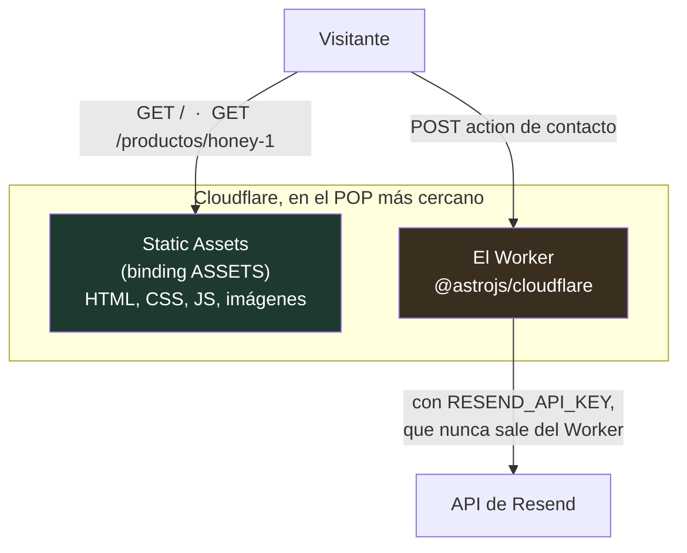
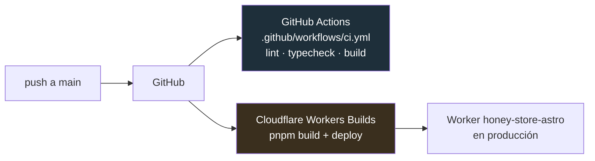

# Cloudflare Workers

Qué es el Worker sobre el que corre Apiaré, qué configura `wrangler.jsonc`, y por
qué Cloudflare abrió un pull request solo.

---

## 1. Qué es un Worker

Un **Worker** es una función que Cloudflare ejecuta en sus servidores, repartida
por todo el mundo, cada vez que llega un request. No es un servidor que vos
prendés y dejás corriendo: no hay proceso esperando, no hay puerto, no hay
máquina que mantener. Llega un request, se ejecuta el código, se devuelve una
respuesta.

La diferencia con un servidor Node tradicional:

|                  | Servidor Node (VPS, Render, Railway)    | Cloudflare Worker                          |
| ---------------- | --------------------------------------- | ------------------------------------------ |
| Qué corre        | Un proceso `node` que vos mantenés vivo | Una función que arranca por request        |
| Dónde            | Una región (ej. Virginia)               | ~300 ciudades, la más cercana al visitante |
| Arranque en frío | Segundos                                | ~5 ms                                      |
| Se paga          | Por tiempo encendido                    | Por request ejecutado                      |
| Runtime          | Node completo                           | `workerd`, un runtime propio               |

Ese último punto es el que más importa en la práctica: **un Worker no es Node**.
Corre sobre V8 (el motor de Chrome) con las APIs web estándar — `fetch`,
`Request`, `Response`, `crypto` — pero sin las APIs nativas de Node. No hay
`fs`, no hay acceso al disco, no hay `process.env` en el sentido clásico. Por eso
el proyecto no puede usar cualquier librería de npm: si por dentro lee archivos o
abre sockets TCP, no funciona.

---

## 2. Por qué esta tienda usa uno

Apiaré es casi entera estática. El catálogo son 4 archivos Markdown que se
conocen en build time, y el carrito vive en `localStorage` (ver
[carrito.md](./carrito.md)). Todo eso se podría servir desde un CDN sin ningún
servidor.

Pero hay una cosa que **no** puede pasar en el navegador: el formulario de
contacto. Mandar el mail vía Resend necesita `RESEND_API_KEY`, y esa clave no
puede terminar en el bundle que descarga el visitante — cualquiera abriría
devtools y la usaría para mandar mails desde tu dominio.

Ahí entra el Worker: es el único pedazo de código del proyecto que corre en un
lugar donde el visitante no puede mirar.



Las páginas salen del CDN sin tocar el Worker: son archivos, ya generados en el
build. El Worker se invoca únicamente para lo dinámico. Eso es lo que hace el
adapter `@astrojs/cloudflare` declarado en `astro.config.mjs:56`.

---

## 3. `wrangler.jsonc`, campo por campo

**Wrangler** es la CLI oficial de Cloudflare para Workers, y `wrangler.jsonc` es
su archivo de configuración. El proyecto tiene este:

```jsonc
{
  "$schema": "./node_modules/wrangler/config-schema.json",
  "compatibility_date": "2026-07-04",
  "compatibility_flags": ["global_fetch_strictly_public"],
  "name": "astro-app",
  "main": "@astrojs/cloudflare/entrypoints/server",
  "assets": {
    "directory": "./dist",
    "binding": "ASSETS",
  },
  "observability": {
    "enabled": true,
  },
}
```

- **`name`** — cómo se llama el Worker en tu cuenta de Cloudflare. Define la URL
  `<name>.<tu-subdominio>.workers.dev` y, sobre todo, **a qué Worker le pega
  `wrangler deploy`**. Es el campo del que trata todo el punto 5.

- **`main`** — el punto de entrada del Worker. No apunta a un archivo tuyo sino a
  uno que trae el adapter de Astro: él sabe cómo tomar un `Request` de Cloudflare,
  pasárselo al router de Astro y devolver un `Response`.

- **`assets`** — le dice a Cloudflare que sirva `./dist` como archivos estáticos
  desde el CDN. El `binding: "ASSETS"` es el nombre con el que el Worker puede
  pedirle un archivo a ese almacén cuando lo necesita. Sin esto, cada imagen
  pasaría por el Worker y contaría como invocación.

- **`compatibility_date`** — congela el comportamiento del runtime a como era ese
  día. Cloudflare arregla y cambia cosas en `workerd` continuamente; si tu Worker
  no fijara una fecha, un cambio de ellos podría romperte el sitio sin que vos
  tocaras nada. Subirla es una decisión explícita, no algo que pasa solo.

- **`compatibility_flags`** — activa comportamientos puntuales sin mover la fecha
  entera. `global_fetch_strictly_public` hace que un `fetch()` a tu propio dominio
  salga a internet público en vez de reentrar al mismo Worker; evita que un
  request se coma a sí mismo en un loop.

- **`observability`** — habilita los logs en el dashboard de Cloudflare. Es donde
  vas a ver el error si el formulario de contacto falla en producción.

### Dónde viven los secretos

`RESEND_API_KEY`, `CONTACT_TO_EMAIL` y `CONTACT_FROM_EMAIL` están declarados como
`context: "server", access: "secret"` en `astro.config.mjs:27-34`. **No van en
`wrangler.jsonc`** — ese archivo está commiteado.

- **En local**: salen de `.dev.vars` (ignorado por git; `.dev.vars.example` es la
  plantilla).
- **En producción**: se cargan con `wrangler secret put NOMBRE` o desde el
  dashboard, y quedan guardados encriptados del lado de Cloudflare.

Esto importa para el punto 5: `wrangler secret put` también usa el `name` del
archivo para saber a qué Worker cargarle el secreto.

---

## 4. Cómo llega el código a producción

El repo está conectado a **Workers Builds**, la integración de Cloudflare con
GitHub. El flujo es:



Son dos cosas distintas que corren en paralelo y que conviene no confundir:

- **GitHub Actions** (`.github/workflows/ci.yml`) es el control de calidad. Corre
  lint, typecheck y build en cada PR. **No despliega nada** — su artefacto se
  tira.
- **Workers Builds** es el deploy real. Cloudflare clona el repo, corre el build
  y publica el resultado en el Worker.

Cuando conectaste el repo, Cloudflare instaló la GitHub App **"Cloudflare Workers
and Pages"** en tu cuenta. Esa app tiene permiso de lectura y de abrir PRs. Es la
que aparece como autora del PR del que trata la sección siguiente.

---

## 5. Por qué Cloudflare abrió el PR #3 solo

> **#3 — "Update name in Wrangler configuration file to match deployed Worker"**
> abierto por `cloudflare-workers-and-pages [Bot]`
> rama: `update_worker_name_to_honey-store-astro`

### El desajuste

Hay dos nombres que deberían ser el mismo y no lo son:

| Dónde                        | Valor               | De dónde salió                                   |
| ---------------------------- | ------------------- | ------------------------------------------------ |
| `wrangler.jsonc:5`           | `astro-app`         | El default de la plantilla `create-astro`        |
| El Worker real en Cloudflare | `honey-store-astro` | Cloudflare lo nombró según el repo al conectarlo |

`astro-app` nunca fue una decisión tuya: viene del scaffold inicial, del commit
`093dc48`. El mismo valor quedó también en `package.json:2`. Cuando después
conectaste el repo a Workers Builds, Cloudflare creó el Worker con el nombre del
repositorio, `honey-store-astro`, y ahí nacieron los dos nombres distintos.

El bot detecta esa diferencia y abre un PR de una línea:

```diff
-  "name": "astro-app",
+  "name": "honey-store-astro",
```

**Nadie hizo nada mal.** Es mantenimiento automático: Cloudflare sabe que un
archivo que miente sobre el nombre del Worker es una trampa esperando, y prefiere
avisarte con un PR antes de que la pises.

### Qué pasa si no lo mergeás

Los deploys desde GitHub siguen funcionando, porque Workers Builds ya tiene el
proyecto vinculado por ID y no le presta atención al campo `name`. El problema
aparece el día que uses Wrangler desde tu máquina:

```bash
wrangler deploy          # crea un Worker NUEVO llamado astro-app
wrangler secret put ...  # le carga el secreto al Worker equivocado
wrangler tail            # escucha logs de un Worker que no recibe tráfico
```

Ninguno de esos comandos falla ni te avisa. Simplemente trabajan sobre un Worker
fantasma mientras el sitio real queda intacto, y vos mirás logs vacíos
preguntándote por qué no pasa nada.

### Conviene mergearlo

Es un cambio de una línea, en la dirección correcta, y no toca nada más del
proyecto. Después del merge, `wrangler.jsonc` describe la realidad y cualquier
comando de Wrangler apunta al Worker que de verdad sirve la tienda.

---

## 6. Glosario

- **Worker** — la función que Cloudflare ejecuta por request. Acá, el runtime
  server de Astro.
- **`workerd`** — el runtime en el que corre. V8 + APIs web, no Node.
- **Wrangler** — la CLI de Cloudflare. Se instala como dependencia del proyecto
  (`package.json:36`).
- **Workers Builds** — la integración GitHub → deploy automático.
- **Static Assets** — los archivos de `./dist` servidos desde el CDN sin invocar
  el Worker.
- **Binding** — un recurso de Cloudflare expuesto al código bajo un nombre. Acá
  solo hay uno: `ASSETS`.
- **Compatibility date** — la fecha a la que está congelado el comportamiento del
  runtime.
- **`.dev.vars`** — los secretos en local. El equivalente en producción son los
  secrets de Cloudflare.
