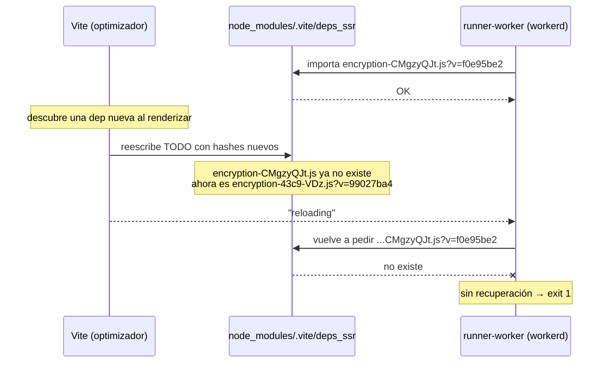

# El optimizador de dependencias de Vite

Qué es el error `The file does not exist at ".../deps_ssr/encryption-CMgzyQJt.js"`,
por qué tira abajo el dev server en este proyecto, y cómo salir.

---

## 1. El error, tal cual aparece

```
16:45:53 [vite] connected.
16:45:54 [vite] optimized dependencies changed. reloading
16:45:54 [vite] [vite] program reload
The file does not exist at "C:/dev/honey-store/node_modules/.vite/deps_ssr/encryption-CMgzyQJt.js?v=f0e95be2"
which is in the optimize deps directory. The dependency might be incompatible with
the dep optimizer. Try adding it to `optimizeDeps.exclude`.
  Stack trace:
    at runInRunnerObject (workers/runner-worker/index.js:107:3)
[ELIFECYCLE] Command failed with exit code 1.
```

Dos cosas antes de entrar en detalle:

- **No es un bug de tu código.** No hay un solo archivo de `src/` en ese stack
  trace. Es infraestructura de Vite hablando con el runtime de Cloudflare.
- **El consejo del último renglón es una pista falsa.** `optimizeDeps.exclude` no
  aplica acá, y la sección 6 explica por qué.

Lo que sí es: una caché interna que se reescribió debajo de un proceso que todavía
estaba leyéndola. Para entender eso hay que arrancar de más atrás.

---

## 2. Punto cero: por qué existe un "optimizador de dependencias"

Cuando el navegador carga un módulo ESM, pide **un archivo por cada `import`**.
Tu código son unas decenas de archivos, así que ahí no hay problema.

El problema es `node_modules`. Una librería moderna no es un archivo: son cientos
de archivos chiquitos que se importan entre sí. Si Vite los sirviera crudos, abrir
el home dispararía miles de requests HTTP y el navegador tardaría una eternidad —
no por peso, sino por cantidad.

Además hay un segundo problema: **no todo npm es ESM**. Mucho paquete todavía se
publica en CommonJS (`require`/`module.exports`), que el navegador no entiende.

Vite resuelve las dos cosas de una: antes de servir nada, agarra las dependencias,
las **pre-empaqueta** con esbuild y deja unos pocos archivos ESM listos para
consumir. Eso es "optimizar dependencias" (_dep optimization_ o _pre-bundling_).
Cientos de archivos entran, un puñado sale.

En este proyecto no es teórico: el optimizador maneja del orden de **200 entradas**
— `astro`, `react`, `react-dom`, `nanostores`, el adapter de Cloudflare, y todos
los internos de Astro que hagan falta.

---

## 3. Dónde vive eso: `node_modules/.vite`

El resultado se guarda en disco para no rehacerlo en cada arranque. En este
proyecto hay **tres cachés separadas**, no una:

| Carpeta      | Entorno                                  | Dónde corre eso      |
| ------------ | ---------------------------------------- | -------------------- |
| `deps`       | El cliente: lo que descarga el navegador | Chrome del visitante |
| `deps_ssr`   | El entorno SSR                           | El runner de Vite    |
| `deps_astro` | El entorno server de Astro               | `workerd`            |

Que sean tres importa: **el mismo paquete se optimiza por separado en cada una**,
con resultados distintos, porque el target no es el mismo. React compilado para el
navegador no es React compilado para `workerd`.

El reparto exacto entre `deps_ssr` y `deps_astro` no es estable — cambia entre
versiones y entre arranques, y de hecho lo vi moverse mientras investigaba esto.
Lo que importa no es cuál guarda qué, sino que **cada una tiene su propio hash y
se reescribe por su cuenta**.

Cada carpeta tiene su `_metadata.json`, que es el índice:

```jsonc
{
  "hash": "3298df38", // huella del contenido optimizado
  "configHash": "c866e62b", // huella de tu astro.config.mjs
  "lockfileHash": "283b2e4d", // huella del pnpm-lock.yaml
  "browserHash": "99027ba4", // el token que se sirve como ?v=
  "optimized": {
    // ... acá va cada dependencia optimizada ...
  },
}
```

Los primeros tres hashes son la **prueba de validez**: si al arrancar Vite ve que
tu config o tu lockfile cambiaron, sabe que la caché quedó vieja y la rehace. Es
la parte sana del sistema.

El cuarto, `browserHash`, es el que aparece en el error. Vite sirve cada
dependencia con ese token pegado:

```
/node_modules/.vite/deps_ssr/encryption-CMgzyQJt.js?v=f0e95be2
                             └──── nombre por contenido ────┘ └── browserHash ──┘
```

El `?v=` existe para **romper la caché del navegador**: si el contenido cambia,
cambia el token, y nadie se queda con una versión vieja pegada. Es una buena idea
que, como vamos a ver, tiene un costo.

---

## 4. Por qué Vite vuelve a optimizar a mitad de camino

Al arrancar, Vite hace un **escaneo**: recorre tus archivos siguiendo los
`import` para armar la lista de dependencias a pre-empaquetar. Ese escaneo es
rápido, y por eso es incompleto. Se le escapan, entre otras:

- imports que aparecen recién en tiempo de render,
- imports dinámicos (`await import(...)`) detrás de una condición,
- internos del framework que Astro carga según qué features use la página.

Entonces pasa lo inevitable: renderizás la primera página, y aparece un módulo
que no estaba en la lista. Vite no puede servirlo crudo, así que **vuelve a correr
el optimizador con la lista corregida**. Ese es el renglón:

```
[vite] optimized dependencies changed. reloading
```

En un proyecto normal esto es un hipo de medio segundo: Vite reescribe la caché,
recarga el grafo de módulos y seguís trabajando. Casi ni lo notás.

---

## 5. Por qué acá eso mata el server

La re-optimización no edita los archivos viejos: escribe **archivos nuevos**, con
nombres nuevos (el hash sale del contenido) y un `browserHash` nuevo. Los viejos
quedan huérfanos o se limpian.

Mientras tanto, el server de Astro no corre en Node: corre dentro de `workerd`, el
runtime de Cloudflare, a través del runner de `@cloudflare/vite-plugin` (ver
[cloudflare-workers.md](./cloudflare-workers.md)). Ese runner ya tiene su grafo de
módulos armado, y ese grafo guarda las URLs **viejas**.



El desfasaje dura milisegundos, pero si el worker pide un módulo justo en esa
ventana, pide un archivo que ya no está. Y en `workerd` eso no es un warning
recuperable como sería en Node: se cae el runner, y con él el comando entero.
De ahí el `[ELIFECYCLE] Command failed with exit code 1`.

### Esto se puede ver en vivo

No es una reconstrucción teórica. Leyendo `deps_ssr/_metadata.json` tres veces en
pocos minutos, el `browserHash` dio tres valores distintos:

```
99027ba4  →  089a8a02  →  efa0eb84
```

Y en la carpeta quedaron **dos chunks de encryption conviviendo**, sobrantes de
rondas distintas del optimizador:

```
encryption-43c9-VDz.js
encryption-2F0Dn2m-.js
```

El que nombra tu error, `encryption-CMgzyQJt.js`, es de una ronda todavía anterior
que ya se limpió. Por eso el archivo "no existe": existió, y dejó de existir
mientras el worker lo tenía anotado.

---

## 6. Por qué `optimizeDeps.exclude` no es la solución

El mensaje sugiere agregar el archivo a `optimizeDeps.exclude`. No se puede, y
conviene entender por qué para no perder una tarde:

`optimizeDeps.exclude` recibe **nombres de paquetes** — `"resend"`, `"nanostores"`
— y significa "a este no lo pre-empaquetes". Pero `encryption-CMgzyQJt.js` no es
un paquete: es un **chunk compartido**, un archivo que inventó esbuild al partir el
bundle en pedazos reutilizables. Ese nombre no existe en ningún `package.json` ni
lo podés escribir en un `import`. Cambia en cada optimización.

El contenido real de ese chunk es `astro/dist/core/encryption.js`, un interno de
Astro que entra por server islands, actions y CSP. Tampoco es algo que quieras
excluir: si lo sacás del optimizador, no arreglás nada y perdés el pre-bundling.

El mensaje es genérico de Vite. Está pensado para el caso "esta librería de npm es
rara y rompe al optimizador", que no es el caso.

---

## 7. Qué hacer

### Si te acaba de pasar

Reiniciá el dev server. Nada más.

```bash
pnpm dev
```

La caché ya quedó escrita **con la dependencia que se descubrió tarde incluida**.
En el segundo arranque Vite valida los hashes, ve que están bien, y no
re-optimiza. Sin re-optimización no hay ventana de desfasaje, y no hay crash.

### Si vuelve a pasar o entra en loop

Borrá la caché y arrancá una sola vez, dejando que la primera request termine
antes de tocar archivos:

```bash
rm -rf node_modules/.vite
pnpm dev
```

Es seguro: `node_modules/.vite` es 100 % derivado, se regenera solo. Lo único que
perdés es el arranque rápido de la próxima vez.

### Si se vuelve crónico

Ahí sí hay que tocar el config, y el fix es `include`, **no** `exclude`:

```js
// astro.config.mjs
vite: {
  ssr: {
    optimizeDeps: {
      include: ["astro/zod", "la-dep-nueva"],
    },
  },
},
```

`include` significa "esta metela en el primer pase aunque el escaneo no la vea". Si
está en el primer pase, no hay segundo pase, y el problema desaparece de raíz.

### Cuándo esperarlo

Es más probable justo después de tocar cualquier cosa que cambie el grafo de
módulos del server: agregar una dependencia, escribir una action nueva, cambiar
`astro.config.mjs`. Si acabás de hacer alguna de esas y ves este error, el primer
arranque es el que paga el costo.

---

## 8. El primo hermano que ya está resuelto

Esto ya pasó antes en el proyecto, con otro síntoma mucho más confuso, y por eso
existe esta línea en `astro.config.mjs:51`:

```js
include: ["astro/zod"],
```

`astro/zod` lo importan `src/actions/index.ts:4` y `src/content.config.ts:3`, pero
el escaneo inicial no lo veía: aparecía recién al renderizar la primera página.
Misma causa exacta que este error — descubrimiento tardío, re-optimización a mitad
de vuelo — pero el síntoma era otro: durante la recarga quedaban **dos instancias
de React vivas al mismo tiempo**, y cualquier componente con `useState` explotaba
con `Invalid hook call`.

Eso parecía un bug de React o una instalación duplicada, y no era ninguna de las
dos. Era esto.

Que el pin está activo se puede verificar en `deps_ssr/_metadata.json`: `astro/zod`
aparece ahí como entrada del entorno SSR desde el primer pase, sin que nadie lo
haya renderizado todavía. Es la única que está declarada a mano; el resto se
descubre solo.

> **No borres esa línea.** Parece config muerta y no lo es. Si algún día un
> "limpiar el config" la saca, vuelve el `Invalid hook call` intermitente.

---

## 9. Glosario

- **Dependencia optimizada / pre-bundling** — una librería de `node_modules`
  pre-empaquetada por Vite para servirla en pocos archivos ESM.
- **Escaneo (_scan_)** — el recorrido inicial de imports con el que Vite arma la
  lista de qué optimizar. Rápido e incompleto por diseño.
- **Re-optimización** — el segundo pase, cuando aparece una dep que el escaneo no
  vio. Es el disparador de este error.
- **`browserHash`** — el token que Vite sirve como `?v=`. Cambia en cada
  optimización.
- **Chunk** — un archivo que genera esbuild al partir el bundle. Nombre por
  contenido, no por paquete. No lo podés referenciar en un `import`.
- **`node_modules/.vite`** — la caché en disco. Tres carpetas, una por entorno.
  Totalmente derivada: borrarla nunca rompe nada.
- **`runner-worker`** — el puente de `@cloudflare/vite-plugin` que corre tu app
  dentro de `workerd` en dev. Es quien aparece en el stack trace.
- **`optimizeDeps.include`** — "optimizá esto en el primer pase aunque no lo veas".
  La herramienta correcta para este problema.
- **`optimizeDeps.exclude`** — "no optimices este paquete". Para librerías
  incompatibles con esbuild. **No** sirve acá.
